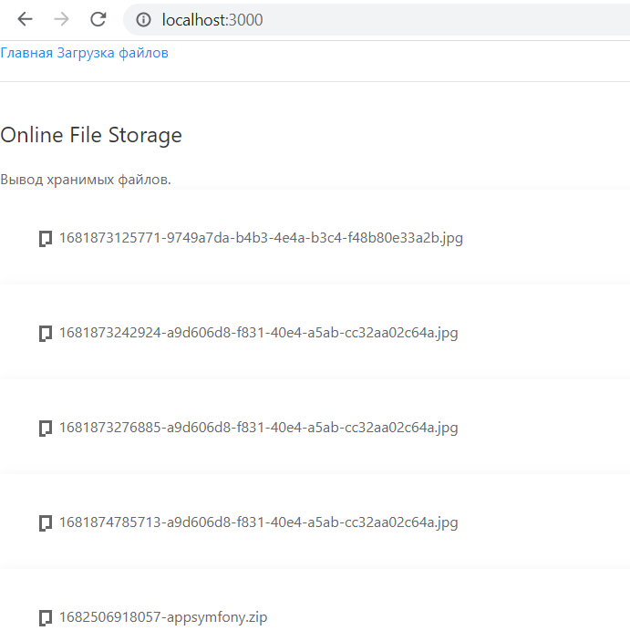

# Still In Progress, coming soon!

## NodeJS Online File Storage
I use:
1) NodeJS, 
2) npm, 
3) Express,
4) hbs (Handlebars - to work with views) 
5) Multer (to work with files)
* To launch project run:
``` node app ```
* To test list of uploaded files run:
``` node folder ```

I got an answer like that: (here's array of uploaded files)


Methods:
* get - получаем при переходе по ссылкам,
* post - получаем даннные из форм,
* set - присваиваем данные,
* put - обновляем данные,
* delete - удаляем данные,
* use -
  
Навигация: 
1) / - главная страница;
2) /upload - страница загрузки;

Верстки пока нет, файлы показываются так:



